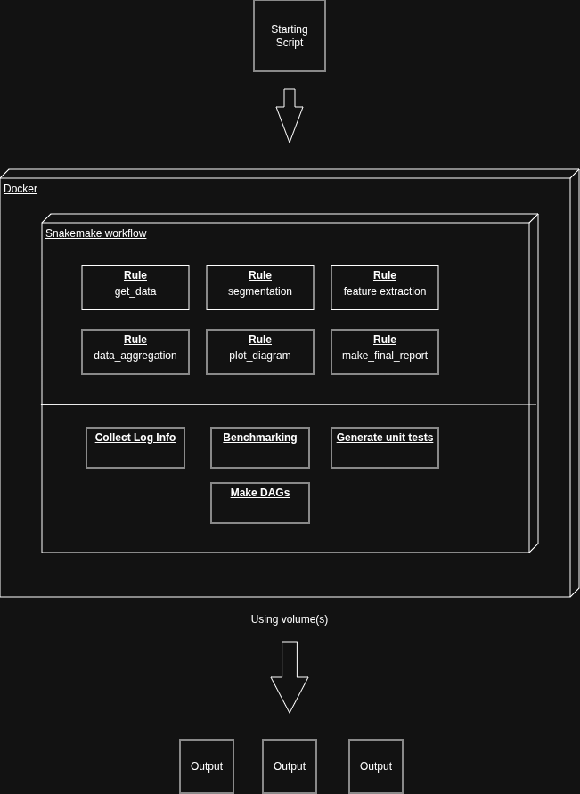

# Conda Installaton

* Choose and install the right package: https://github.com/conda-forge/miniforge/releases

* Or run in terminal (for linux):
    ```
    wget https://github.com/conda-forge/miniforge/releases/download/25.9.1-0/Miniforge3-25.9.1-0-Linux-x86_64.sh
    ```
* Make the file executable: `chmod +x Miniforge3-25.9.1-0-Linux-x86_64.sh `
* Run the installer: `Miniforge3-25.9.1-0-Linux-x86_64.sh `
* Activate Conda in your shell: `source ~/miniforge3/bin/activate`
* Initialize Conda: `conda init`

# Snakemake installation using Conda
* Install Snakemake: `conda create -c conda-forge -c bioconda -c nodefaults -n snakemake snakemake`
* Activate Snakemake: `conda activate snakemake`
* For more information: https://snakemake.readthedocs.io/en/stable/getting_started/installation.html


# Use Linter while working on Snakemake
## Best practices - Care about code quality
Snakemake (>=5.11) comes with a code quality checker (a so called linter), that analyzes your workflow and highlights issues that should be solved in order to follow best practices, achieve maximum readability, and reproducibility. 
* The linter can be invoked with `snakemake --lint` after activating Snakemake

**given that a Snakefile or workflow/Snakefile is accessible from your working directory.** It is highly recommended to run the linter before publishing any workflow, asking questions on Stack Overflow or filing issues on Github.

Source: https://snakemake.readthedocs.io/en/stable/snakefiles/best_practices.html

# Proposal architecture for using Snakemake

Snakemake provides:
*  `-rerun-incomplete` and `-restart-times` for recovery
    * See other execution commands: https://snakemake.readthedocs.io/en/stable/executing/cli.html

*  **Logging output** of each job into a separate file, instead of just printing all logging output to the terminal. For this purpose, Snakemake allows to specify log files for rules. Log files are defined via the log directive. Logs info will be under `/logs/` folder.
    * https://snakemake.readthedocs.io/en/stable/tutorial/advanced.html#step-5-logging

* **Benchmarking:** When a job derived from the rule is executed, Snakemake will measure the wall clock time and memory usage (in MiB) and store it in the file in tab-delimited format. It is possible to repeat a benchmark multiple times in order to get a sense for the variability of the measurements.
    * https://snakemake.readthedocs.io/en/stable/tutorial/additional_features.html#benchmarking

* **Automatic deployment of software dependencies via envs:** You can specify Conda environments per rule that will automatically create required environments and activate them before a job is executed. The workflow definition documents all used software versions to the final report.
    * If some rules use the same dependencies, then we should use the same env (we need to avoid unnecessary files). 
    * https://snakemake.readthedocs.io/en/stable/tutorial/additional_features.html#automatic-deployment-of-software-dependencies

* **Visualizing the directed acyclic graph (DAG) of jobs:** https://snakemake.readthedocs.io/en/stable/tutorial/basics.html#step-4-indexing-read-alignments-and-visualizing-the-dag-of-jobs

* **Specifying the number of used threads:** Snakemake can be made aware of the threads a rule needs with the threads directive. When a workflow is executed, the number of threads the jobs need is considered by the Snakemake scheduler. In particular, the scheduler ensures that the sum of the threads of all jobs running at the same time does not exceed a given number of available CPU cores.
    * https://snakemake.readthedocs.io/en/stable/tutorial/advanced.html#step-1-specifying-the-number-of-used-threads

* **Automatically generating unit tests:** https://snakemake.readthedocs.io/en/stable/snakefiles/testing.html

* **The final interactive report:** Automatically generate detailed self-contained HTML reports that you can easily move and share. 
    * https://snakemake.readthedocs.io/en/stable/snakefiles/reporting.html

Other notes:
* **Dealing with very large workflows:** Snakemake allows to run large workflows in batches.

* **Profiles:** May be necessary when defining different config.yaml files for CSC and TYKS.

* https://snakemake.readthedocs.io/en/stable/executing/cli.html

## About the Snakemake rules

Every computational step that transforms data, produces files, or triggers a process should be represented as a Snakemake rule. 

Any function or script that:

* reads or writes data,

* executes an algorithm,

* generates intermediate or final outputs,

* depends on previous results

must be executed through a rule in the Snakefile.
That ensures Snakemake can:

* track dependencies automatically,

* rebuild only what changed,

* checkpoint and resume (--rerun-incomplete),

* parallelize correctly.

You do not need a rule for:

* internal helper functions used inside a single processing script,

* purely configuration or plotting utilities,

* trivial file operations that don’t affect dependencies.

Everything that moves the pipeline forward should appear as a rule so the workflow can be resumed, logged, and verified automatically.

## About the new folder structure

* `rules/`: Split Snakefile into smaller parts by defining new files with the ending `.smk` and adding the line `include: "module1.smk"` at the top of the main Snakefile. For example one file under rules/ could include all rules for morphometry and second file could include all rules for segmentation, etc. 

* `scripts/`: Gather all scripts here (can be under subfolders).

* `envs/`: All Snakemake environments here.

* `data/`: Test datasets here.

## How to get all envs into a single Docker image

Command `snakemake --use-conda --conda-create-envs-only` pre-builds all Conda environments defined in the workflow without running any rules.

Normally Snakemake creates each environment the first time its rule runs.

This command:

* scans all rules using conda: directives,

* resolves and downloads all dependencies,

* builds each environment once under .snakemake/conda/,

* then stops (no workflow execution).

You can then copy those environments into your Docker image so that runtime inside the container is instant and offline.

Dockerfile:
```
COPY .snakemake/conda /root/.snakemake/conda 
```
Now every rule runs using its ready-made Conda env, no network access or conda installation needed at runtime.

## To control the image size

* Reuse dependencies across envs (same versions of Python, NumPy, etc.),

* Use mamba instead of Conda,

* Clean caches with mamba clean --all -y,

* Merge environments manually for related rules.

## Architect proposal

Example of Dockerfile approach:

```
FROM mambaorg/micromamba:1.5.8

# Create working directory
WORKDIR /app
COPY . /app

# Optional: install Snakemake
RUN micromamba install -y -n base -c conda-forge snakemake python=3.12 \
    && micromamba clean --all --yes

ENTRYPOINT ["snakemake", "--cores", "all"]
```
This image already has Mamba preinstalled and is lighter and faster than Conda-based ones.

An example diagram:
