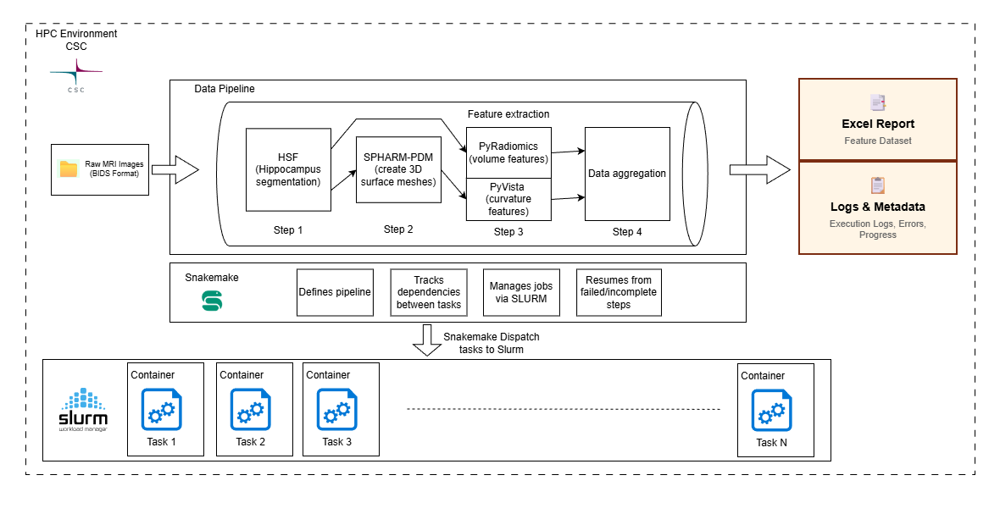

# CSC HPC Cluster Pipeline

Technical documentation for running the hippocampus radiomic feature extraction pipeline on CSC Puhti using **Snakemake 8.x + SLURM + Apptainer**. Each Snakemake rule is submitted as a separate SLURM job that runs inside a single shared Apptainer container.

> **For step-by-step usage instructions, see [CSC User Guide](guide_csc.md).**

---

## Architecture Overview



### Single Container Design

The pipeline uses **one container image** for all rules. A global `container:` directive in the Snakefile points every SLURM job at the same `.sif` file:

```python
# In Snakefile
CONTAINER_IMAGE = config.get("container_image", "docker://ghcr.io/bigbrain/hippocampus-pipeline:latest")
container: CONTAINER_IMAGE
```

The container (~4.3 GiB) bundles all dependencies:

| Dependency | Used By |
|-----------|---------|
| HSF, ONNX Runtime, PyTorch (CPU) | `hsf_segmentation` |
| nibabel, scikit-image, SimpleITK | `split_label`, `combine_labels` |
| VTK, PyVista, OSMesa | `mesh_per_label`, `mesh_combined` |
| PyRadiomics, scipy | `extract_pyradiomics_*`, `extract_curvature_*` |
| pandas | `aggregate_subject_features`, `aggregate_all_subjects` |
| Snakemake 7.32.4 | Workflow engine (inside container, used in local/Docker mode only) |

> **Why a single container?** Simpler maintenance, one build pipeline, one image to cache on CSC. All rules use `shell:` directives that call Python scripts via CLI, so there are no import-time dependency conflicts between rules.

### Key Differences: CSC vs Tyks/Local

| Aspect | Tyks / Local (Docker) | CSC (SLURM + Apptainer) |
|--------|----------------------|------------------------|
| **Runner** | `run_pipeline.py` | `run_csc.py` |
| **Container runtime** | Docker | Apptainer (from same image) |
| **Snakemake version** | 7.32.4 (inside container) | 8.x (host module) |
| **Job dispatch** | All rules in one process | Each rule = separate SLURM job |
| **Parallelism** | Limited to local cores | Up to 100 concurrent SLURM jobs |
| **Profile** | `config/profiles/tyks/` | `config/profiles/csc/` (auto-generated) |
| **Batch mode** | `--batch-size` flag | Not needed (SLURM handles parallelism) |

### Why Container Directives Are Required on CSC

On CSC, Snakemake runs on the **login node** as a dispatcher. It submits each rule as a separate SLURM batch job. Each compute node needs to know which container to run, and the `container:` directive is how Snakemake communicates this — it generates `apptainer exec <image> ...` commands for each job.

In Docker/local mode, the `container:` directive is ignored because the Tyks profile doesn't set `software-deployment-method: apptainer`. Everything runs inside a single Docker container that already has Snakemake and all dependencies.

---

## How It Works

### Pipeline Steps and Rules

All rules use `shell:` directives that invoke Python scripts via CLI (`argparse`). This is critical for CSC compatibility — `run:` and `script:` directives cause pickle serialization issues between the host Snakemake (8.x) and the container Python (3.11).

| Step | Rule(s) | Script | Memory | Description |
|------|---------|--------|--------|-------------|
| 1 | `hsf_segmentation` | `hsf_wrapper.py` | 8 GB (default) | HSF hippocampal segmentation |
| 2 | `split_label` | `nii_parse.py split` | 200 MB | Split cropped segmentation into per-label masks |
| 2 | `combine_labels` | `nii_parse.py combine` | 8 GB (default) | Merge all labels into combined mask |
| 3 | `mesh_per_label` | `voxelToMesh.py` | 4 GB | Generate VTK meshes + PNG renders |
| 3 | `mesh_combined` | `voxelToMesh.py` | 8 GB (default) | Generate VTK meshes + PNG renders |
| 4 | `extract_pyradiomics_per_label` | `feature_extraction.py pyradiomics` | 3 GB | Extract volume and surface features |
| 4 | `extract_pyradiomics_combined` | `feature_extraction.py pyradiomics` | 8 GB (default) | Extract volume and surface features |
| 5 | `extract_curvature_per_label` | `feature_extraction.py curvature` | 3 GB | Extract curvature metrics from meshes |
| 5 | `extract_curvature_combined` | `feature_extraction.py curvature` | 8 GB (default) | Extract curvature metrics from meshes |
| 6 | `aggregate_subject_features` | `cli_aggregate.py subject` | 2 GB | Combine per-subject features into one row |
| 6 | `aggregate_all_subjects` | `cli_aggregate.py all` | 8 GB (default) | Merge all subjects into `all_features.csv` |

### SLURM Job Flow

```
run_csc.py (login node)
  |
  +--> Snakemake 8.x (login node, dispatcher)
        |
        +-- sbatch hsf_segmentation[sub-01]  --> compute node --> apptainer exec .sif python hsf_wrapper.py ...
        +-- sbatch hsf_segmentation[sub-02]  --> compute node --> apptainer exec .sif python hsf_wrapper.py ...
        +-- sbatch hsf_segmentation[sub-03]  --> compute node --> apptainer exec .sif python hsf_wrapper.py ...
        |   (wait for dependencies...)
        +-- sbatch split_label[sub-01,L,DG]  --> compute node --> apptainer exec .sif python nii_parse.py split ...
        +-- sbatch split_label[sub-01,L,CA1] --> compute node --> apptainer exec .sif python nii_parse.py split ...
        +-- sbatch mesh_per_label[sub-01,L,DG] --> ...
        +-- ... (continues for all rules)
        |
        +-- sbatch aggregate_all_subjects    --> compute node --> apptainer exec .sif python cli_aggregate.py all ...
        |
        `--> All jobs done, results on shared /scratch
```

Each SLURM job:
1. Runs `apptainer exec <sif> <command>` on a compute node
2. Reads/writes to shared `/scratch` filesystem
3. Gets its own SLURM log and Snakemake benchmark file

---

## CSC Profile (`config/profiles/csc/config.yaml`)

The profile is **auto-generated** by `run_csc.py` with your project-specific settings. You should not need to edit it manually.

```yaml
# Auto-generated by run_csc.py
executor: slurm

jobs: 100
keep-going: true
latency-wait: 120
retries: 1
printshellcmds: true
rerun-incomplete: true
local-cores: 1

default-resources:
  - slurm_account=project_<NUMBER>
  - slurm_partition=small
  - mem_mb=8000
  - runtime=120
  - "tmpdir='/scratch/project_<NUMBER>/<user>/tmp'"

software-deployment-method:
  - apptainer

apptainer-args: "--bind /scratch/project_<NUMBER>:/scratch/project_<NUMBER>:rw --env HSF_HOME=/users/$USER/.hsf"
```

Key settings:

| Setting | Purpose |
|---------|---------|
| `executor: slurm` | Submit each rule as a SLURM batch job |
| `software-deployment-method: apptainer` | Run each job inside the container via `apptainer exec` |
| `default-resources: mem_mb=8000` | Default memory per job (overridden per-rule where appropriate) |
| `default-resources: tmpdir=...` | Temp dir on shared `/scratch` (compute nodes can't see `/tmp`) |
| `apptainer-args: --bind ...` | Mount `/scratch` read-write inside the container |
| `keep-going: true` | Don't abort if one subject fails |
| `latency-wait: 120` | Wait up to 120s for output files to appear on Lustre |

---

## Building the Container

### 1. Build Docker Image (locally)

```bash
cd radiomic-feature-extraction-hippocampus-morphometry
docker build -f pipeline/Dockerfile -t hippocampus-pipeline:latest .
```

The Dockerfile (`pipeline/Dockerfile`) is based on `python:3.11-slim` and installs all dependencies including HSF, PyRadiomics, VTK/PyVista, and Snakemake 7.32.4. Pipeline code is baked in via `COPY pipeline /app/pipeline`.

### 2. Transfer to CSC

**Option A: Push to a container registry, pull on CSC**

```bash
# Local: tag and push
docker tag hippocampus-pipeline:latest registry.example.com/hippocampus-pipeline:latest
docker push registry.example.com/hippocampus-pipeline:latest

# On CSC:
apptainer pull hippocampus-pipeline.sif docker://registry.example.com/hippocampus-pipeline:latest
```

**Option B: Export as tarball, copy to CSC, convert**

```bash
# Local: save Docker image
docker save hippocampus-pipeline:latest -o hippocampus-pipeline.tar

# Copy to CSC
scp hippocampus-pipeline.tar username@puhti.csc.fi:/scratch/project_<NUMBER>/$USER/

# On CSC: convert to SIF
apptainer build hippocampus-pipeline.sif docker-archive://hippocampus-pipeline.tar
```

> **Important:** Set `APPTAINER_CACHEDIR` and `APPTAINER_TMPDIR` on `/scratch` before pulling/building. See the [CSC User Guide](guide_csc.md) for details.

---

## Running the Pipeline

### Primary Method: `run_csc.py`

The `run_csc.py` wrapper handles everything automatically:

```bash
ssh username@puhti.csc.fi
cd /scratch/project_<NUMBER>/$USER/hippocampus-pipeline/pipeline

# Interactive (prompts for all settings)
python3 run_csc.py

# Non-interactive
python3 run_csc.py \
  --project <NUMBER> \
  --bids-root /scratch/project_<NUMBER>/$USER/Dataset \
  --sif /scratch/project_<NUMBER>/$USER/Containers/hippocampus-pipeline.sif

# Dry run
python3 run_csc.py -n
```

What `run_csc.py` does automatically:
1. Loads the `snakemake` module (via Lmod) if not already available
2. Verifies Snakemake >= 8.0 is installed
3. Collects project settings (interactive prompts or CLI flags)
4. Creates shared `TMPDIR`, `APPTAINER_CACHEDIR`, `APPTAINER_TMPDIR` on `/scratch`
5. Clears stale `SINGULARITY_BIND` / `APPTAINER_BIND` environment variables
6. Generates the CSC Snakemake profile with your project details
7. Launches Snakemake with a live ASCII progress bar
8. Reports summary with duration, job counts, and output location

See [CSC User Guide - Command-Line Options](guide_csc.md#command-line-options) for all flags.

### Alternative: Direct Snakemake (advanced)

If you prefer to run Snakemake directly (e.g., for debugging), you need to set up the environment manually:

```bash
# Load snakemake
module load snakemake

# Set up temp/cache directories
export TMPDIR=/scratch/project_<NUMBER>/$USER/tmp
export APPTAINER_CACHEDIR=/scratch/project_<NUMBER>/$USER/.apptainer
export APPTAINER_TMPDIR=$TMPDIR
mkdir -p $TMPDIR $APPTAINER_CACHEDIR
unset SINGULARITY_BIND APPTAINER_BIND

# Run from the pipeline/ directory
cd /scratch/project_<NUMBER>/$USER/hippocampus-pipeline/pipeline

snakemake \
  --snakefile workflow/Snakefile \
  --profile config/profiles/csc \
  --config \
    bids_root=/scratch/project_<NUMBER>/$USER/Dataset \
    derivatives_root=/scratch/project_<NUMBER>/$USER/Dataset/derivatives \
    container_image=/scratch/project_<NUMBER>/$USER/Containers/hippocampus-pipeline.sif
```

> Note: You must first edit `config/profiles/csc/config.yaml` to fill in your project number and paths, or let `run_csc.py` generate it once and then use `snakemake` directly afterward.

---

## Resource Allocation

Resources are managed at two levels:

### Default Resources (CSC profile)

Set in `default-resources` of the auto-generated profile:

| Resource | Default Value | Purpose |
|----------|---------------|---------|
| `slurm_account` | Your project | SLURM billing account |
| `slurm_partition` | `small` | SLURM partition |
| `mem_mb` | 8000 | Memory per job (8 GB) |
| `runtime` | 120 | Max runtime in minutes |
| `tmpdir` | `/scratch/.../tmp` | Temp dir on shared storage |

### Per-Rule Overrides

Rules that need less (or more) memory override the default in their `.smk` files:

| Rule | `mem_mb` | `threads` | Notes |
|------|----------|-----------|-------|
| `hsf_segmentation` | 8000 (default) | 2 | Uses CPU-only ONNX runtime |
| `split_label` | 200 | 1 | Simple NIfTI masking |
| `combine_labels` | 8000 (default) | 1 | Uses default profile memory |
| `mesh_per_label` | 4000 | 1 | VTK mesh generation |
| `mesh_combined` | 8000 (default) | 1 | Uses default profile memory |
| `extract_pyradiomics_per_label` | 3000 | 1 | PyRadiomics feature extraction |
| `extract_pyradiomics_combined` | 8000 (default) | 1 | Uses default profile memory |
| `extract_curvature_per_label` | 3000 | 1 | Curvature computation on meshes |
| `extract_curvature_combined` | 8000 (default) | 1 | Uses default profile memory |
| `aggregate_subject_features` | 2000 | 1 | CSV aggregation |
| `aggregate_all_subjects` | 8000 (default) | 1 | Uses default profile memory |

The default 8 GB is used by any rule without an explicit `mem_mb` override. This includes `hsf_segmentation` and several "combined"/aggregation rules in the current workflow.

### CSC vs Tyks/Local Override Behavior

- **CSC (SLURM + Apptainer):** `mem_mb` and `runtime` are translated into SLURM job requests. Per-rule `resources.mem_mb` overrides profile defaults per job.
- **Tyks/Local (Docker path):** no SLURM submission is used, so there are no SLURM memory/time requests. `threads` still controls local parallel scheduling, while `mem_mb` mainly acts as Snakemake resource metadata unless additional resource limits are set at runtime.

---

## Output Structure

All results are written to `<bids_root>/derivatives/`:

```
<bids_root>/
  derivatives/
    sub-01/
      ses-1/
        anat/
          sub-01_ses-1_space-T1w_desc-hsf_dseg.nii.gz          # HSF segmentation
          sub-01_ses-1_space-T1w_desc-hsf_hemi-L_seg_crop.nii.gz
          sub-01_ses-1_space-T1w_desc-hsf_hemi-L_label-DG_mask.nii.gz
          sub-01_ses-1_space-T1w_desc-hsf_hemi-L_mask.nii.gz    # combined mask
          ...
        features/
          sub-01_ses-1_hemi-L_label-DG_pyradiomics.csv
          sub-01_ses-1_hemi-L_label-DG_curvature.csv
          sub-01_ses-1_all_features.csv                          # per-subject aggregate
          ...
        meshes/
          sub-01_ses-1_space-T1w_desc-hsf_hemi-L_label-DG_mesh.vtk
          sub-01_ses-1_space-T1w_desc-hsf_hemi-L_label-DG_mesh.png
          ...
    summary/
      all_features.csv           # Final aggregated features (all subjects)
      processing_issues.txt      # Subjects with processing errors
    logs/
      run_csc_<timestamp>.log    # Snakemake execution log
      hsf/                       # Per-rule logs
      data_processing/
      mesh/
      feature_extraction/
      benchmarks/                # Snakemake timing benchmarks per job
```

---

## Monitoring & Debugging

### Live Progress

`run_csc.py` shows a real-time ASCII progress bar:

```
  Pipeline [42/503] |########................................| 8% / sub-03 Mesh
```

### Check SLURM Jobs

```bash
# All your jobs
squeue -u $USER

# Jobs for your project
squeue -A project_<NUMBER>
```

### View Logs

```bash
# Snakemake log (written by run_csc.py)
cat <bids_root>/derivatives/logs/run_csc_<timestamp>.log

# Per-rule logs
cat <bids_root>/derivatives/logs/hsf/sub-01_ses-1.log
cat <bids_root>/derivatives/logs/feature_extraction/sub-01_ses-1_hemi-L_label-DG.log

# Benchmarks (CPU time, memory, I/O)
cat <bids_root>/derivatives/logs/benchmarks/hsf/sub-01_ses-1.txt
```

### Dry Run

Preview planned jobs without executing:

```bash
python3 run_csc.py -n
```

### Troubleshooting

| Problem | Solution |
|---------|----------|
| `snakemake: command not found` | `module load snakemake` (done automatically by `run_csc.py`) |
| `FATAL: mount source /tmp/...` | Stale `TMPDIR` — run `run_csc.py` (auto-fixes) or manually set `TMPDIR` to `/scratch/...` |
| Stale locks / incomplete files | `python3 run_csc.py --clean --force` |
| `apptainer pull` fails | Set `APPTAINER_CACHEDIR` and `APPTAINER_TMPDIR` on `/scratch` (see [User Guide](guide_csc.md)) |
| Pipeline interrupted (`Ctrl+C`) | SLURM jobs may still run: `squeue -u $USER` then `scancel -u $USER` |
| One subject fails, rest continue | `keep-going: true` in profile; check `processing_issues.txt` |

---

## Comparison: Tyks/Local vs CSC Execution

### Tyks / Local (Docker)

```bash
docker run --rm \
  -v /path/to/data:/data \
  hippocampus-pipeline:latest \
  --bids-root /data --batch-size 50 --cores 4
```

- Runs `run_pipeline.py` inside a single Docker container
- Snakemake 7.32.4 (inside container) manages all rules sequentially/locally
- Batched processing (`--batch-size`) for memory management

### CSC (SLURM + Apptainer)

```bash
python3 run_csc.py \
  --project <NUMBER> \
  --bids-root /scratch/project_<NUMBER>/$USER/Dataset \
  --sif /scratch/project_<NUMBER>/$USER/Containers/hippocampus-pipeline.sif
```

- Runs `run_csc.py` on the **login node**
- Snakemake 8.x (host module) submits each rule as a SLURM job
- Each SLURM job runs inside the Apptainer container on a compute node
- Up to 100 parallel jobs across the cluster (no batching needed)

---

## References

- [CSC SLURM Documentation](https://docs.csc.fi/computing/running/submitting-jobs/)
- [CSC Apptainer Guide](https://docs.csc.fi/computing/containers/run-existing/)
- [Snakemake 8.x SLURM Executor Plugin](https://snakemake.github.io/snakemake-plugin-catalog/plugins/executor/slurm.html)
- [Snakemake Container Integration](https://snakemake.readthedocs.io/en/stable/snakefiles/deployment.html#running-jobs-in-containers)
- [Puhti Batch Partitions](https://docs.csc.fi/computing/running/batch-job-partitions/)
