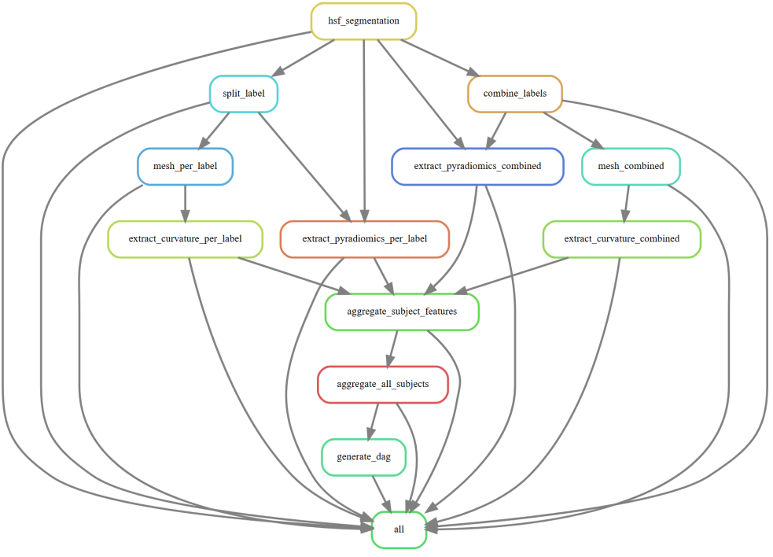

# Rule Graph Explanation

Snakemake rulegraph is a dependency diagram: each box is a rule, and each arrow means “the upstream rule produces files that the downstream rule needs as input.” 

## **From top to bottom**

**1)** Starting point of the actual processing: **hsf_segmentation**

- hsf_segmentation is the first real computation step in the graph.

- It produces the base segmentation output that nearly everything else depends on.

**2)** Two main branches from the segmentation

- After hsf_segmentation, the workflow splits into two conceptually different paths:

    **A)** Per-label (subfield-wise) path

    - **2A.1.** **split_label**

        - Takes the segmentation and splits it into separate label masks (e.g., DG/CA1/CA2/CA3/SUB).

    - **2A.2** Geometry from individual labels

        - **mesh_per_label**

            - Builds a surface mesh for each individual label.

        - **extract_curvature_per_label**

            - Computes curvature (shape descriptors) from each per-label mesh.

    - **2A.3** Texture/intensity features from individual labels

        - **extract_pyradiomics_per_label**

            - Extracts PyRadiomics features per label.

            - In the graph this rule depends on outputs from split_label and also directly on hsf_segmentation (meaning it needs both the label masks and something else from the original segmentation context).

    **B)** Combined-label path

    - **2B.1** **combine_labels**

        - Combines multiple labels into a single mask (e.g., “whole hippocampus” or another combined ROI).

    - **2B.2** Geometry from combined ROI

        - **mesh_combined**

            - Builds a mesh for the combined ROI.

        - **extract_curvature_combined**

            - Computes curvature from the combined mesh.

    - **2B.3** Texture/intensity features from combined ROI

        - **extract_pyradiomics_combined**

            - Extracts PyRadiomics features from the combined ROI.

            - It depends on combine_labels, and in the graph it also has a direct dependency line from hsf_segmentation (meaning it needs original information plus the combined mask).

**3)** Per-subject feature collection: **aggregate_subject_features**

- This rule is where the branches converge.

- It gathers the outputs from:

    - **extract_pyradiomics_per_label**

    - **extract_pyradiomics_combined**

    - **extract_curvature_per_label**

    - **extract_curvature_combined**

- Then it produces a single per-subject feature file (typically a CSV/TSV/JSON) that contains all features for that subject.

**4)** Across-subject aggregation: **aggregate_all_subjects**

- Takes all per-subject aggregated feature files from aggregate_subject_features

- Merges/concatenates them into a cohort-level dataset (one table for all subjects).

**5)** Visualization artifact: **generate_rulegraph**

- Depends on aggregate_all_subjects in the graph. Generates the workflow rule graph after the final aggregation is completed.

**6)** Final target rule: **all**

- all is the “goal” rule. It is a list of files that must exist and be up-to-date at the end. Snakemake works backwards from each listed file, finds the rule that produces it, and builds the dependency graph.

## What rules can run in parallel

Two rules can run in parallel if:

* neither rule depends on the other (no arrow between them), and

* all of their required inputs are already available.

Once hsf_segmentation for a subject is done:

- split_label and combine_labels can run independently.

- Per-label mesh/curvature and per-label radiomics can run in parallel (as long as their inputs exist).

- Combined mesh/curvature and combined radiomics can also run in parallel.

- Aggregations (aggregate_subject_features, then aggregate_all_subjects) happen after the needed upstream outputs exist.